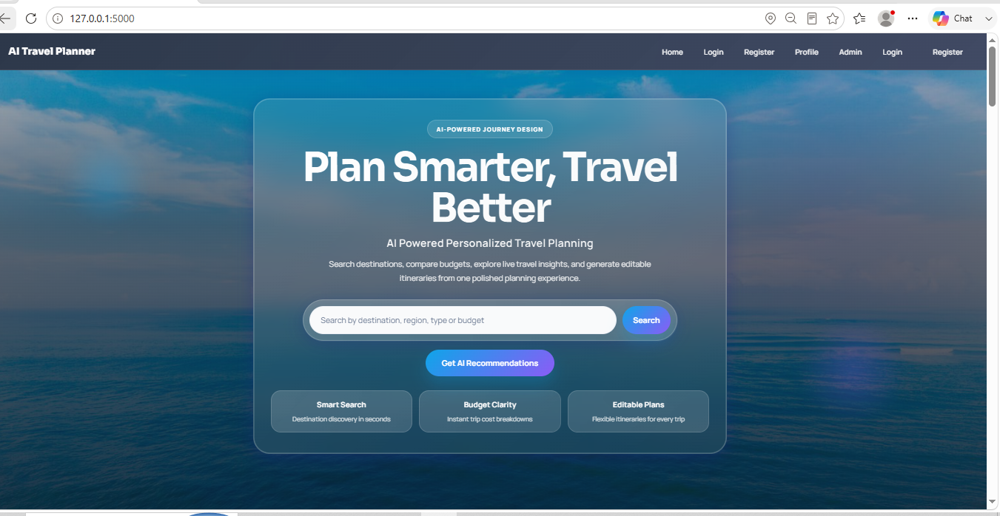
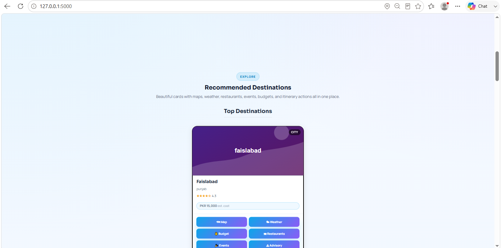
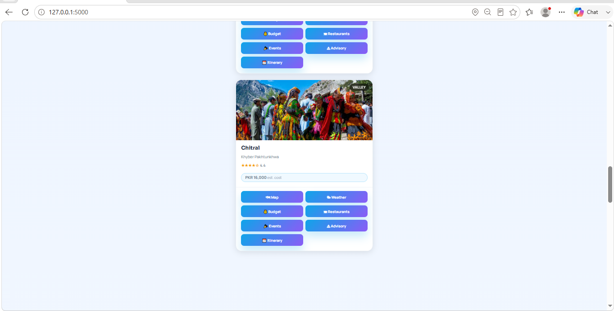
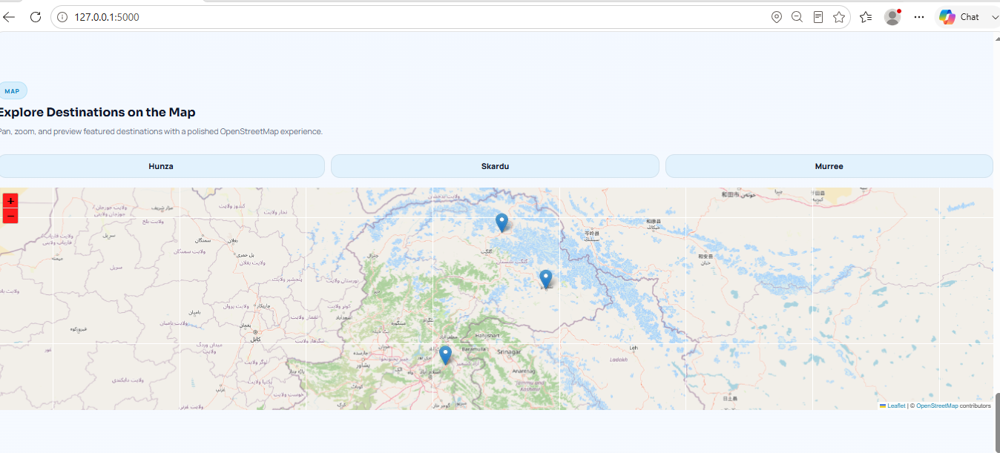
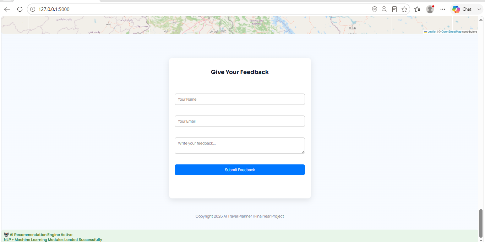
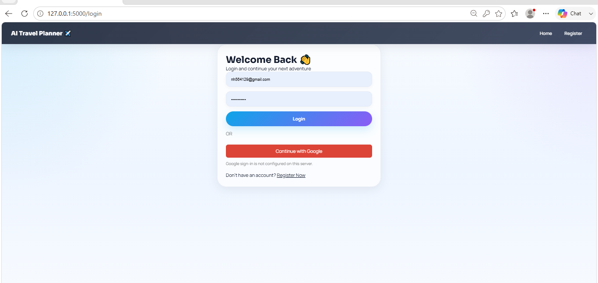
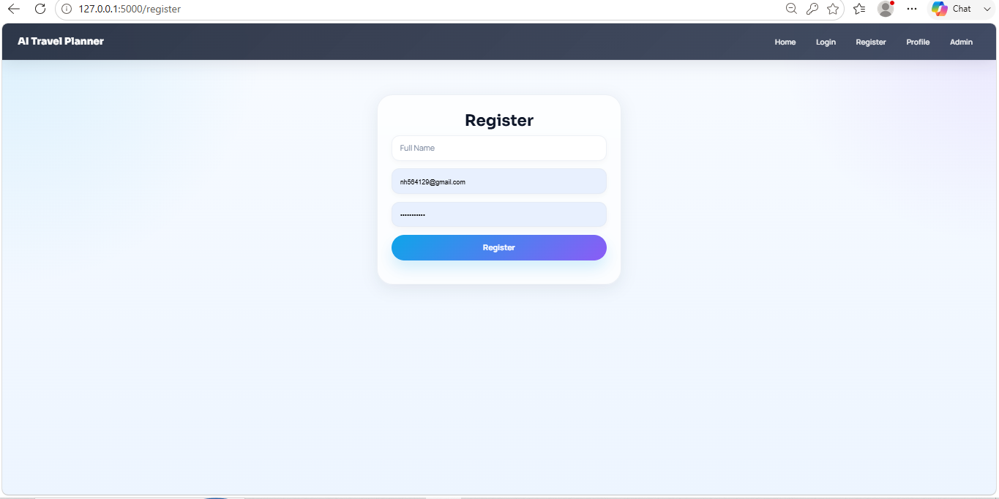
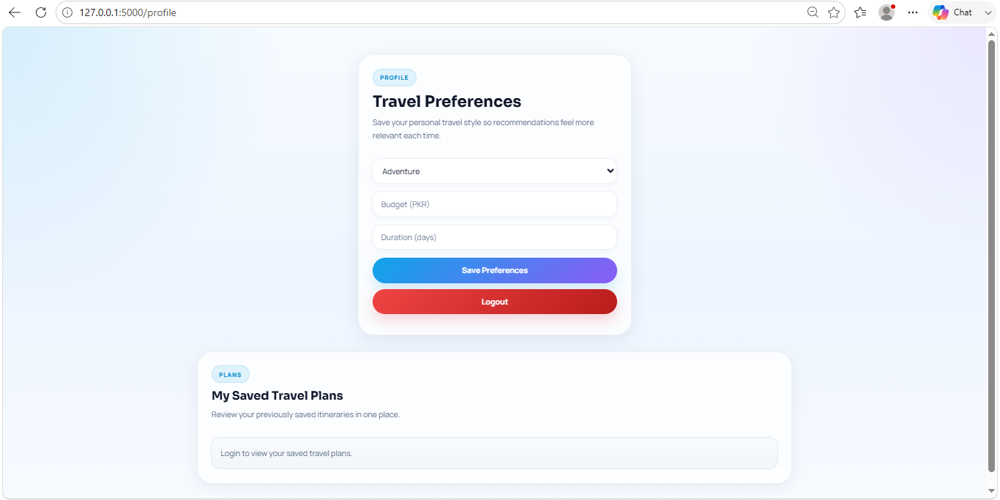
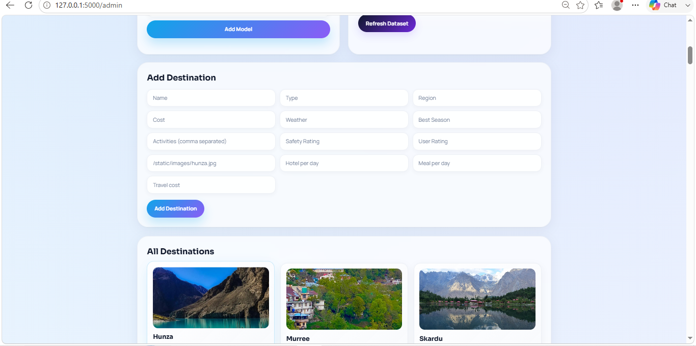

# ✈️ AI Travel Planner

**AI Powered Personalized Travel Planning** — search destinations, compare budgets, explore live travel insights, and generate editable itineraries, all from one polished planning experience.

> 🎓 Final Year Project — Built with Python (Flask), Machine Learning & OpenStreetMap


---

## 📖 Table of Contents

- [About the Project](#-about-the-project)
- [Features](#-features)
- [Screenshots](#-screenshots)
- [Tech Stack](#-tech-stack)
- [Project Structure](#-project-structure)
- [Getting Started](#-getting-started)
- [Environment Variables](#-environment-variables)
- [Usage](#-usage)
- [Admin Dashboard](#-admin-dashboard)
- [Roadmap](#-roadmap)
- [Contributing](#-contributing)
- [License](#-license)
- [Contact](#-contact)

---

## 📌 About the Project

**AI Travel Planner** is a web application that helps users plan trips smarter by combining **AI-based recommendations**, **budget breakdowns**, **live weather & maps**, and **editable itineraries** in a single platform. Users can search destinations by region, type, or budget, view detailed destination cards (weather, restaurants, events, safety advisory), explore locations on an interactive map, and save personalized travel preferences to their profile.

An **Admin Dashboard** allows management of destinations, AI recommendation models, restaurants, events, and user feedback — all from one clean interface.

---

## ✨ Features

### 🌍 For Users
- **Smart Search** — discover destinations in seconds by name, region, type, or budget
- **AI Recommendations** — get personalized destination suggestions based on travel preferences
- **Destination Cards** — each destination shows rating, estimated cost (PKR), and quick-access actions:
  - 🗺️ Map &nbsp; ☁️ Weather &nbsp; 💰 Budget &nbsp; 🍽️ Restaurants &nbsp; 🎉 Events &nbsp; ⚠️ Advisory &nbsp; 📅 Itinerary
- **Interactive Map** — pan, zoom, and preview featured destinations (Hunza, Skardu, Murree, and more) using Leaflet + OpenStreetMap
- **Budget Clarity** — instant trip cost breakdowns (hotel/day, meals/day, travel cost)
- **Editable Itineraries** — flexible, editable travel plans for every trip
- **User Accounts** — register/login with email & password, with an option for Google Sign-In
- **Profile & Preferences** — save travel style (Adventure, Budget, Duration) so recommendations get more relevant over time
- **Saved Travel Plans** — revisit previously generated itineraries
- **Feedback System** — users can submit feedback directly from the app

### 🛠️ For Admins
- **User Statistics** — live counts of Users, Ratings, Feedback, AI Models, Restaurants, and Events
- **AI Model Management** — activate/deactivate recommendation models (e.g., Content-Based Recommender)
- **Destination Management** — add new destinations with details like type, region, cost, weather, best season, activities, safety rating, and images
- **Dataset Refresh** — refresh the underlying destinations dataset with a single click
- **Feedback Monitoring** — view all user feedback in one place

---

## 🖼️ Screenshots

### 🏠 Home Page


### 🌐 Recommended Destinations
| Destination Cards | Destination Details |
|---|---|
|  |  |

### 🗺️ Interactive Map


### 💬 Feedback Form


### 🔐 Authentication
| Login | Register |
|---|---|
|  |  |

### 👤 Profile & Travel Preferences


### 🛠️ Admin Dashboard
| Dashboard Overview | Add Destination |
|---|---|
|  |  |

> 📁 Make sure a `screenshots/` folder with these images exists in the repo root for the images above to render on GitHub.

---

## 🧰 Tech Stack

| Layer | Technology |
|---|---|
| **Backend** | Python, Flask |
| **Frontend** | HTML5, CSS3, JavaScript |
| **Maps** | Leaflet.js + OpenStreetMap |
| **Machine Learning** | scikit-learn, TensorFlow |
| **Data Handling** | pandas, NumPy |
| **NLP** | Natural Language Processing module (`nlp.py`) for understanding user search queries/preferences |
| **Database** | SQL (`database/travel_db.sql`) |
| **Auth** | Email/Password (Flask sessions), Google Sign-In (optional) |
| **Config** | `.env` for environment variables, `runtime.txt` for Python runtime version (deployment-ready) |

---

## 📂 Project Structure

```
AI TRAVEL PLANNER FYP/
│
├── database/
│   ├── settings.json         # Database connection/config settings
│   └── travel_db.sql         # SQL schema & seed data
│
├── static/
│   ├── images/                # Destination images
│   ├── leaflet/                # Leaflet.js library (maps)
│   ├── admin.js                # Admin dashboard scripts
│   ├── main.js                 # Core frontend scripts
│   ├── map.html                # Interactive map page
│   └── style.css               # Stylesheets
│
├── templates/                  # Flask Jinja2 HTML templates
│
├── app.py                      # Flask application entry point
├── destinations.json           # Destinations dataset
├── itinerary.py                # Itinerary generation logic
├── ml_model.py                 # ML recommendation model (scikit-learn / TensorFlow)
├── nlp.py                      # NLP module for query/preference processing
├── requirements.txt            # Python dependencies
├── runtime.txt                 # Python runtime version (for deployment)
├── .env                         # Environment variables (not committed)
├── .gitignore
└── screenshots/                # README screenshots
```

---

## 🚀 Getting Started

### Prerequisites
- Python 3.8+
- pip
- Git

### Installation

1. **Clone the repository**
   ```bash
   git clone https://github.com/Emanabc/AI-Travel-Planner.git
   cd AI-Travel-Planner
   ```

2. **Create a virtual environment**
   ```bash
   python -m venv venv
   source venv/bin/activate      # On Windows: venv\Scripts\activate
   ```

3. **Install dependencies**
   ```bash
   pip install -r requirements.txt
   ```

4. **Set up the database**
   - Create a database and import the schema:
     ```bash
     mysql -u root -p your_database_name < database/travel_db.sql
     ```
     *(or use your preferred SQL client to run `database/travel_db.sql`)*
   - Update connection details in `database/settings.json` and/or `.env`

5. **Set up environment variables**
   (see [Environment Variables](#-environment-variables) below)

6. **Run the application**
   ```bash
   python app.py
   ```

7. **Open in your browser**
   ```
   http://127.0.0.1:5000
   ```

---

## 🔑 Environment Variables

Create a `.env` file in the project root (if applicable) with values such as:

```env
FLASK_APP=app.py
FLASK_ENV=development
SECRET_KEY=your_secret_key

# Database (SQL)
DB_HOST=localhost
DB_USER=your_db_user
DB_PASSWORD=your_db_password
DB_NAME=travel_db

# Google Sign-In (optional)
GOOGLE_CLIENT_ID=your_google_client_id
GOOGLE_CLIENT_SECRET=your_google_client_secret
```

---

## 🤖 Machine Learning & NLP

- **`ml_model.py`** — houses the recommendation model(s) built with **scikit-learn** and **TensorFlow**, including the *Content-Based Recommender* manageable from the Admin Dashboard.
- **`nlp.py`** — handles Natural Language Processing for interpreting free-text search queries (e.g., "budget hill stations under 20000 PKR") and matching them against destination data.
- **`pandas`** and **`numpy`** are used for dataset loading, cleaning, and feature preparation from `destinations.json` / `travel_db.sql`.
- **`itinerary.py`** — generates and manages editable day-wise itineraries for selected destinations.

---

## 🧭 Usage

1. **Register/Login** to create an account (or continue as a guest, where supported).
2. **Search** for a destination by name, region, type, or budget on the home page.
3. Browse **Recommended Destinations** and tap into Map, Weather, Budget, Restaurants, Events, Advisory, or Itinerary for any card.
4. Explore destinations visually on the **Interactive Map**.
5. Go to your **Profile** to set travel preferences (style, budget, duration) for more relevant AI recommendations.
6. Leave **Feedback** to help improve the app.

---

## 🛠️ Admin Dashboard

Accessible at `/admin` for authorized admin users:

- View real-time **User Statistics** (users, ratings, feedback, models, restaurants, events)
- **Activate/Deactivate** AI recommendation models
- **Add new destinations** with full details (cost, weather, best season, activities, safety & user ratings, images, hotel/meal/travel costs)
- **Refresh Dataset** to pull in updated destination data
- Review all **User Feedback** submitted through the app

---

## 🗺️ Roadmap

- [ ] Add more destinations & regions
- [ ] Improve AI recommendation accuracy (hybrid recommender)
- [ ] Add real-time weather API integration
- [ ] Add PDF export for itineraries
- [ ] Mobile-responsive UI improvements
- [ ] Deploy to a live server (Render/Heroku/PythonAnywhere)

---

## 🤝 Contributing

This project was independently developed by **Eeman Ajmal** as a Final Year Project. Suggestions and improvements are still welcome:

1. Fork the repository
2. Create your feature branch (`git checkout -b feature/AmazingFeature`)
3. Commit your changes (`git commit -m 'Add some AmazingFeature'`)
4. Push to the branch (`git push origin feature/AmazingFeature`)
5. Open a Pull Request

---

## 📄 License

This project is licensed under the **MIT License** — feel free to use and modify it for learning purposes.

---

## 📬 Contact

**Developed by:** Eeman Ajmal

**Project Repository:** [AI-Travel-Planner](https://github.com/Emanabc/AI-Travel-Planner)

For questions or suggestions, feel free to open an [issue](https://github.com/Emanabc/AI-Travel-Planner/issues).

---

<p align="center">Made with ❤️ by <b>Eeman Ajmal</b> — Final Year Project</p>
